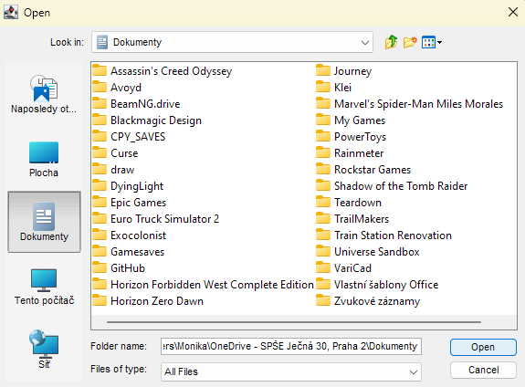
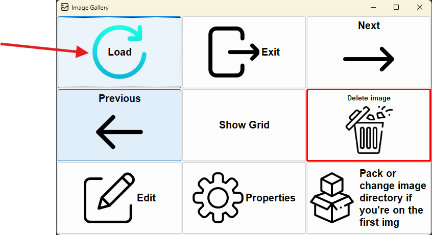
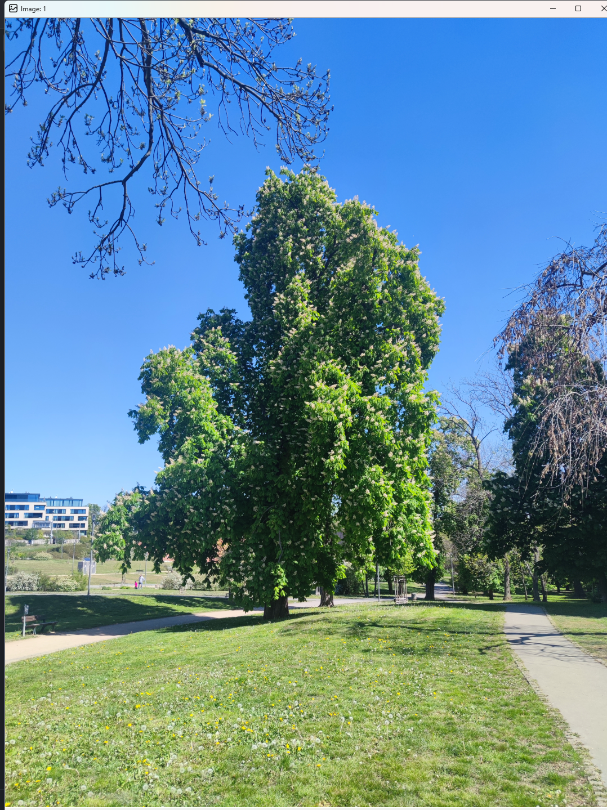
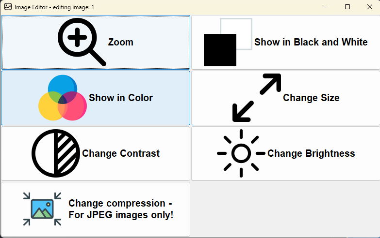
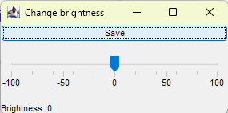
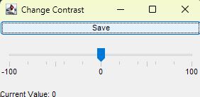
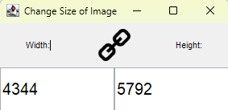

# Welcome to Java Gallery
### This app is used to view, edit, and save images from your PC.

#### Here is how to start:
### 1.Select an **image folder** from the menu.

### 2. Click **Load**. It will take some time, so don't panic.

### 3. After its **loaded**, an `image` from the folder will pop up. The list is not sorted by any means.

## In the image menu, there are several options:
- Load
- Edit Image
- Exit
- Next, previous image
- Show Grid
- Properties - *same as in show grid*.
- Pack or change image directory
### Each of these options do something.
#### Show grid is used to view the grid of all images in the list. Next and previous are self-explanatory, as is exit.
When you click show grid:

You can *click* each image and view their **properties**. This includes size, pixels, etc...
### To edit an image:   navigate to the desired image by *next* and *previous* and click *Edit*.

- ## You will have several options:
- Zoom the image.
- Show the image in grayscale (black and white).
- Show in color.
- Change brightness, contrast, compression.
- If an error occurs, a dialog will pop up. You can check the error and click **OK.**
- You can save the changed image.
## Examples:
   
### **When you are changing** the size of the image, it is linked with the aspect ratio of the image.